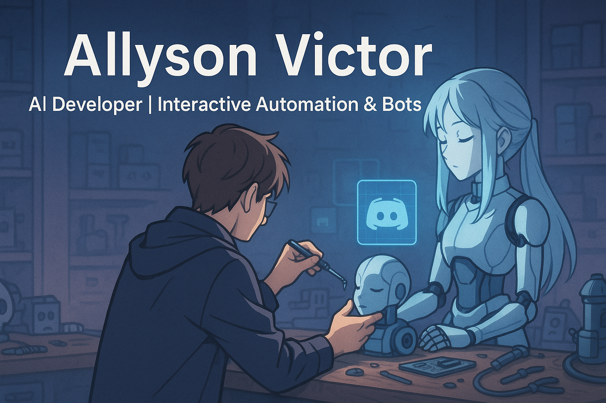

## 👋 Sobre mim

Desenvolvedor com foco em Inteligência Artificial, aplicando soluções práticas em diferentes plataformas e ambientes interativos.

## 🧠 Principais habilidades

- 💻 **Linguagens:** Python, JavaScript  
- 🧰 **Tecnologias:** OpenCV, FFMPEG, TensorFlow, PyTorch, Pandas, Uvicorn, FastAPI, Matplotlib, Scikit-Learn  
- 🗄️ **Bancos de Dados:** PostgreSQL, SQLite  
- 🤖 **Foco:** Desenvolvimento e implementação de modelos de IA aplicados

## ⚙️ Experiência prática

- Integração de modelos de IA em:
  - 🎮 **Minecraft:** agentes capazes de jogar e interagir em tempo real
  - 💬 **Discord e WhatsApp:** bots com processamento de linguagem natural, análise de imagem e automações

## 📫 Contato

-   
- 📧 [allysonvbm@gmail.com](mailto:allysonvbm@gmail.com)
